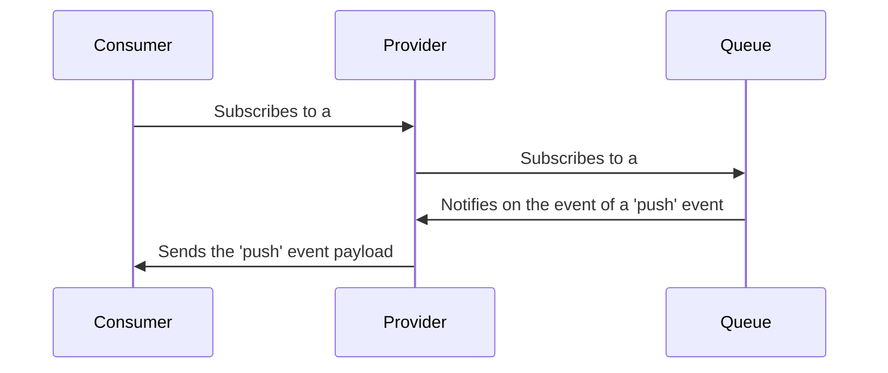

# py-consumer

A test implementation on a pub-sub architecture with Python. 🐍

## Index

1. [Index](#index)
2. [About](#about)
3. [Architecture](#architecture)
4. [How to run](#how-to-run)
   1. [Requirements](#requirements)
   2. [Make](#make)
   3. [Without make](#without-make)
5. [Author](#author)

## About

This is mainly a test on doing event-driven stuff with data streams. As you'll see, there's two main folders in this project, those being:

- core
  - Where the interfaces and protocols for data structures and classes are defined.
- impl
  - Where the interfaces are implemented.

The premise of this project is a simulation of a world cup, where many countries are elected to play a game with each other. Every _n_ seconds a goal is made by another team and the notification is sent to the provider.

## Architecture



## How to run

### Requirements

- Python >= 3.8

### Make

```sh
$ make dev
```

### Without make

```sh
$ python src/main.py
```

## Author

|  |
| ------------------------------------------------------ |
| [Eder Lima](https://github.com/asynched)               |
